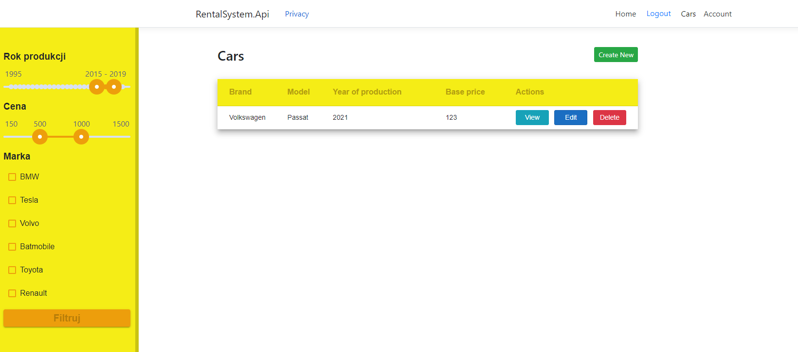
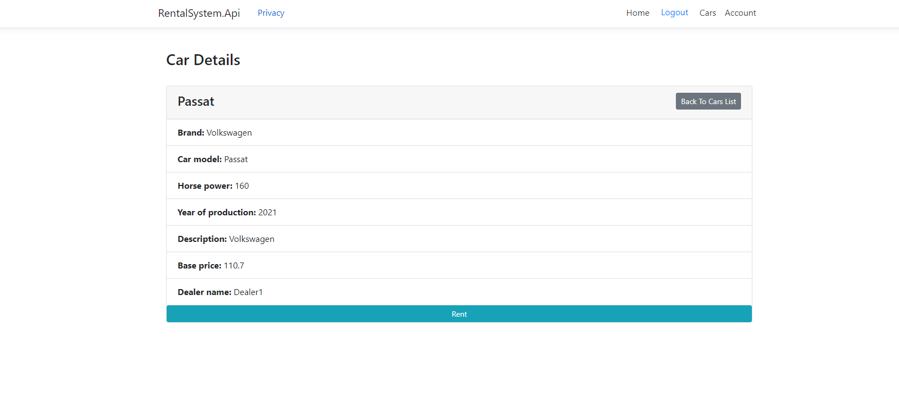
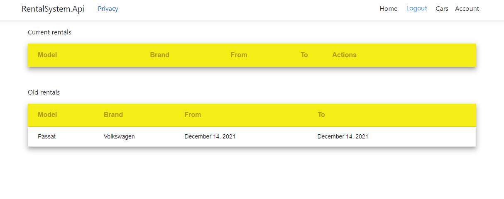
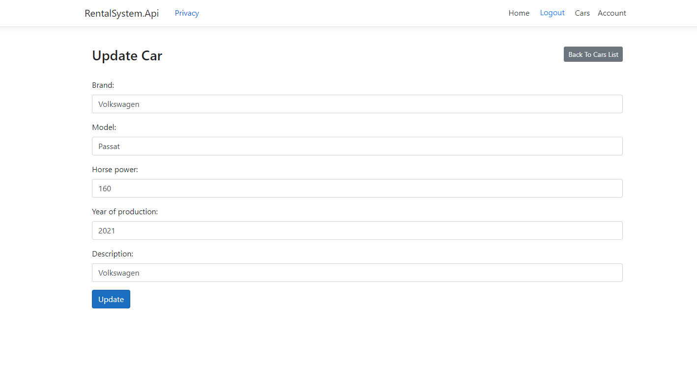
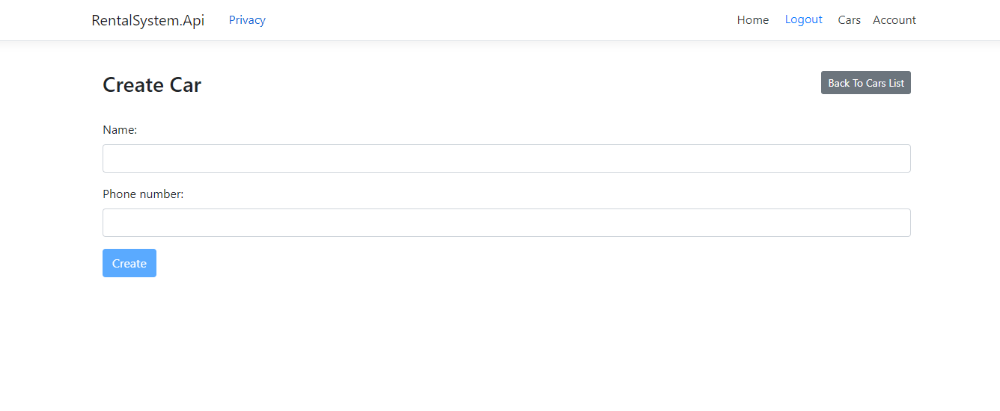

## Table of Contents
* [General Information](#general-information)
* [Technologies Used](#technologies-used)
* [Use cases](#use-cases-are-following)
* [Screenshots](#screenshots)
* [Usage](#usage)
* [Contact](#contact)

## General Information
- Authors:
  * Janusz Kobojek
  * Szymon Koński
  * Piotr Krasowski
- This project is made for educational purposes.
- Our goal is to implement a simple car-renting service with the .NET 5 and Microsoft Azure cloud services. 

## Technologies Used
- Backend: ASP.NET
- Frontend: Angular
- Hosting: Azure
- Database: MSSQL

## Use cases are following:
- Customer can create account (register)
- Customer can sign in
- Customer can display list of all available cars
- Customer can make a reservation for a specific car (if it is not already reserved by other customer)
- Customer can send new enquiry and attach the file

## Screenshots
##### The landing page

##### List of available cars

##### Viewing the details

##### User's account - with a list of all past rents

##### Admin's page for editing the cars' data

##### Adding new dealers by the admin

## Usage
Our application can be used by anyone from a small to a large business to increase accessibility for potential clients and manage all of the logic concerning renting and returning cars.

##Solution architecture

### Azure Active Directory B2C
Azure Active Directory B2C is used for user authentication (login, registration, password reset)

### Azure Application Insights
Azure Active Directory B2C is used for collecting logs and detecting bugs.

### Azure Web Apps with App Service Plans
Cars Rental System Web portal is written with Angular framework and Cars API is written with ASP .NET Core. These web applications are hosted using Azure Web Apps.

### Azure Function Apps
In the Cars Rental System, Azure Function App was used to handle events related to sending car's reservation confirmation emails once custom complete reservation in the web portal. 
This Function App is triggered once there is a new message in the Azure Service Bus queue.

### Azure Service Bus
In the Cars Rental System, Azure Service Bus queues were used to queue car's reservation confirmations to send emails to customers. 
Once car's reservation is completed in the web portal, information is passed to the API and saved in the database. 
After this process, there is new message sent to the queue. Then Azure Function is triggered and new email is sent using Azure SendGrid Service.

### Azure SendGrid
Azure SendGrid service is used for sending customized emails.

### Azure Storage Account
In the Cars Rental System, it is used to store car images and pdf files that are send by user when returning car.

## Contact

szymon.konski@outlook.com
